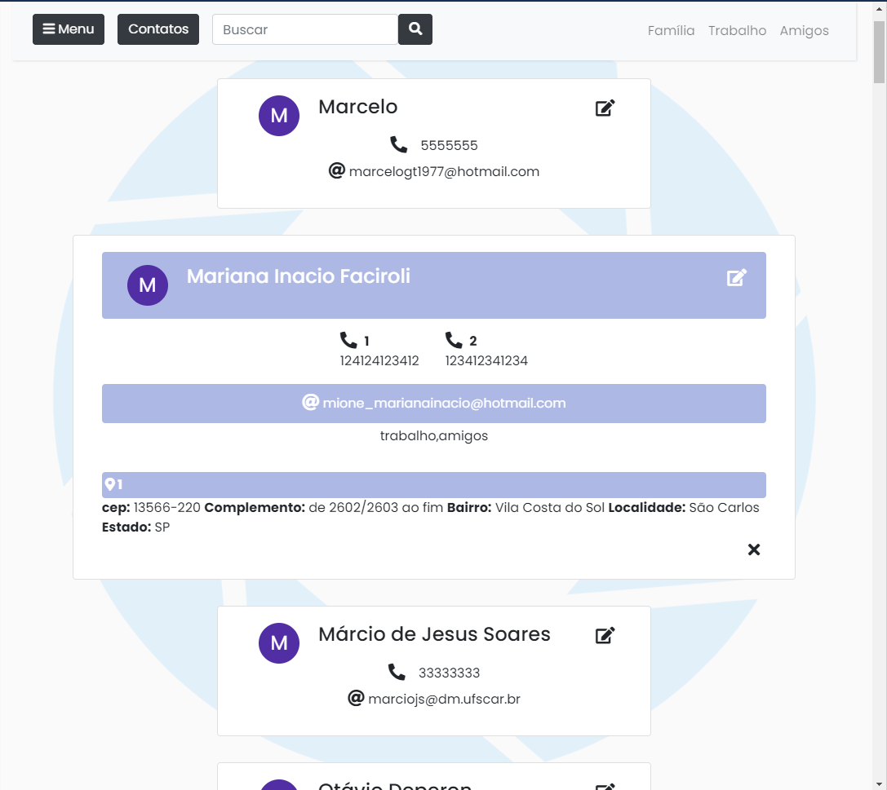

# AgendaJS

Projeto de agenda feita em JavaScript e HTML,
Onde a parte do servidor foi construída utilizando Node.JS.

Por razões de segurança o arquivo .ENV com informações de login e senha do servidor não estão disponívels. 

